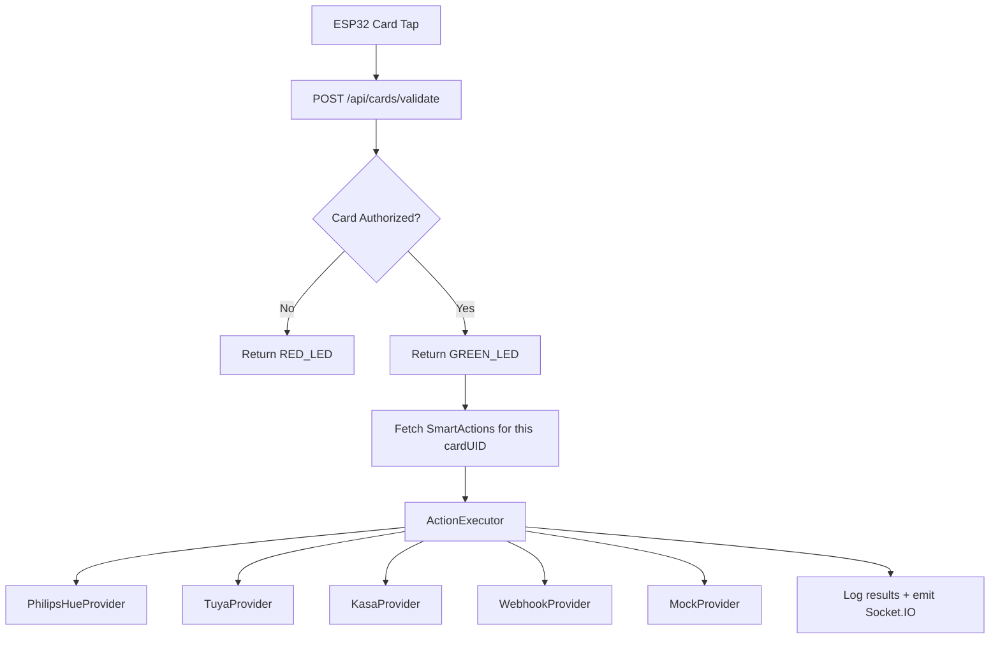

# Smart Home Actions System — Implementation Plan

## Goal

Add a **generic, pluggable smart home actions engine** to the existing RFID backend. When an authorized card is tapped, the backend not only responds with `GREEN_LED` — it also fires configurable smart home actions (toggle lights, switch fans, trigger webhooks, etc.).

The system is designed so you can add new device providers (Philips Hue, Tuya, Alexa, etc.) later by simply dropping in a new provider file — no architectural changes needed.

---

## Current State

The card validation flow is:

```
ESP32 → POST /api/cards/validate → card.controller.ts → { authorized, action: "GREEN_LED" }
```

The `action` field is a simple string (`GREEN_LED` / `RED_LED`). We'll extend this flow to also trigger smart home actions when `authorized === true`.

---

## Architecture



### Provider Interface

Every smart home provider implements one interface:

```typescript
interface ISmartHomeProvider {
  name: string;                           // "philips_hue", "tuya", etc.
  execute(config: any): Promise<ActionResult>;  // Do the thing
  validate(config: any): boolean;         // Check config before saving
}
```

This makes the system fully extensible — add a file, register the provider, done.

---

## Proposed Changes

### Backend — Models

---

#### [NEW] [SmartAction.ts](file:///c:/Users/j7654/WorkStation/Internet_of_Things/rfid_reader/backend/src/models/SmartAction.ts)

New Mongoose model that maps a card UID (or user) to one or more smart home actions.

```typescript
{
  _id: ObjectId,
  name: string,              // "Turn on bedroom lights"
  cardUID: string | null,    // Trigger on this specific card, OR...
  userId: ObjectId | null,   // ...trigger for any card belonging to this user
  trigger: "on_authorized" | "on_denied" | "on_any",  // When to fire
  provider: string,          // "philips_hue" | "tuya" | "kasa" | "webhook" | "mock"
  action: string,            // "toggle" | "turn_on" | "turn_off" | "set_brightness" | "custom"
  config: {                  // Provider-specific configuration
    // Philips Hue example:
    bridgeIp?: string,
    apiKey?: string,
    lightId?: string,
    brightness?: number,
    color?: { hue: number, saturation: number },
    
    // Webhook example:
    url?: string,
    method?: string,
    headers?: Record<string, string>,
    body?: any,
    
    // Mock example:
    mockDelay?: number,
    mockSuccess?: boolean,
  },
  isEnabled: boolean,
  priority: number,          // Execution order (lower = first)
  cooldownMs: number,        // Prevent rapid re-triggering (default: 2000)
  lastExecuted: Date | null,
  createdAt: Date,
  updatedAt: Date,
}
```

Key design decisions:
- **`cardUID` vs `userId`**: Actions can be bound to a specific card OR to a user (so if they change cards, actions follow them)
- **`trigger`**: Most actions fire `on_authorized`, but you could set up an alarm action on `on_denied` (intruder alert)
- **`cooldownMs`**: Prevents the same action from firing repeatedly if someone taps twice quickly
- **`priority`**: Controls execution order when multiple actions are bound to one card

---

#### [NEW] [ActionLog.ts](file:///c:/Users/j7654/WorkStation/Internet_of_Things/rfid_reader/backend/src/models/ActionLog.ts)

Tracks every smart home action execution for debugging and audit.

```typescript
{
  _id: ObjectId,
  actionId: ObjectId,        // Reference to SmartAction
  actionName: string,        // Denormalized for easy reading
  provider: string,
  cardUID: string,
  userId: ObjectId | null,
  status: "success" | "failed" | "skipped",  // skipped = cooldown
  error: string | null,
  durationMs: number,        // How long the provider took
  timestamp: Date,
}
```

---

### Backend — Smart Home Services

---

#### [NEW] [providers/types.ts](file:///c:/Users/j7654/WorkStation/Internet_of_Things/rfid_reader/backend/src/services/smarthome/types.ts)

Core TypeScript interfaces for the provider system:

```typescript
export interface ActionResult {
  success: boolean;
  message: string;
  data?: any;
}

export interface ISmartHomeProvider {
  name: string;
  displayName: string;
  execute(action: string, config: any): Promise<ActionResult>;
  validate(config: any): { valid: boolean; errors: string[] };
}
```

---

#### [NEW] [providers/mock.provider.ts](file:///c:/Users/j7654/WorkStation/Internet_of_Things/rfid_reader/backend/src/services/smarthome/providers/mock.provider.ts)

A **simulated provider** for testing the entire flow without real hardware. Logs actions to console and returns configurable success/failure. This is what you'll use to verify the system works before buying any smart devices.

- Supports: `turn_on`, `turn_off`, `toggle`, `set_brightness`
- Configurable: `mockDelay` (simulates network latency), `mockSuccess` (force success/failure)

---

#### [NEW] [providers/webhook.provider.ts](file:///c:/Users/j7654/WorkStation/Internet_of_Things/rfid_reader/backend/src/services/smarthome/providers/webhook.provider.ts)

A **generic HTTP webhook provider** — the most versatile one. Sends an HTTP request to any URL when a card is tapped. This alone covers:
- IFTTT triggers (Alexa, Google Home, anything IFTTT supports)
- Home Assistant webhooks
- Custom Node-RED endpoints  
- Any REST API

Config: `url`, `method` (GET/POST/PUT), `headers`, `body` (with template variables like `{{userName}}`, `{{cardUID}}`)

---

#### [NEW] [providers/philips_hue.provider.ts](file:///c:/Users/j7654/WorkStation/Internet_of_Things/rfid_reader/backend/src/services/smarthome/providers/philips_hue.provider.ts)

Philips Hue local Bridge API integration. Stub implementation with the correct API structure — ready to activate when you get Hue lights.

- Actions: `turn_on`, `turn_off`, `toggle`, `set_brightness`, `set_color`
- Config: `bridgeIp`, `apiKey`, `lightId` or `groupId`

---

#### [NEW] [providers/tuya.provider.ts](file:///c:/Users/j7654/WorkStation/Internet_of_Things/rfid_reader/backend/src/services/smarthome/providers/tuya.provider.ts)

Tuya Cloud API integration stub. Tuya powers ~60% of smart devices in India (Smart Life, Wipro Smart, etc.).

- Actions: `turn_on`, `turn_off`, `toggle`
- Config: `accessId`, `accessKey`, `deviceId`

---

#### [NEW] [providers/kasa.provider.ts](file:///c:/Users/j7654/WorkStation/Internet_of_Things/rfid_reader/backend/src/services/smarthome/providers/kasa.provider.ts)

TP-Link Kasa local API stub. Works over LAN without cloud dependency.

- Actions: `turn_on`, `turn_off`, `toggle`
- Config: `deviceIp`

---

#### [NEW] [executor.ts](file:///c:/Users/j7654/WorkStation/Internet_of_Things/rfid_reader/backend/src/services/smarthome/executor.ts)

The **action execution engine**. This is the central orchestrator:

1. Receives a card tap event (UID + user + status)
2. Queries `SmartAction` collection for matching actions
3. Filters by `trigger`, `isEnabled`, and cooldown
4. Executes each action through its provider (in priority order)
5. Logs results to `ActionLog`
6. Emits `action:executed` Socket.IO event for the dashboard
7. Handles errors gracefully (one failed action doesn't block others)

---

#### [NEW] [registry.ts](file:///c:/Users/j7654/WorkStation/Internet_of_Things/rfid_reader/backend/src/services/smarthome/registry.ts)

Provider registry — a simple map of `providerName → provider instance`. Auto-registers all built-in providers on startup. To add a new provider, you just:

```typescript
registry.register(new MyCustomProvider());
```

---

### Backend — API Routes

---

#### [NEW] [action.routes.ts](file:///c:/Users/j7654/WorkStation/Internet_of_Things/rfid_reader/backend/src/routes/action.routes.ts)

New REST endpoints for managing smart home actions from the dashboard:

| Method | Endpoint | Purpose |
|--------|----------|---------|
| `GET` | `/api/actions` | List all actions (with filters: cardUID, userId, provider) |
| `GET` | `/api/actions/:id` | Get single action details |
| `POST` | `/api/actions` | Create a new action |
| `PUT` | `/api/actions/:id` | Update an action |
| `DELETE` | `/api/actions/:id` | Delete an action |
| `POST` | `/api/actions/:id/test` | Test-fire an action (without a real card tap) |
| `GET` | `/api/actions/providers` | List available providers and their config schemas |
| `GET` | `/api/actions/logs` | Get action execution logs (paginated) |

All routes protected by JWT `authMiddleware`.

---

#### [NEW] [action.controller.ts](file:///c:/Users/j7654/WorkStation/Internet_of_Things/rfid_reader/backend/src/controllers/action.controller.ts)

Controller implementing the above routes. The `test` endpoint is particularly useful — it lets you trigger any action from the dashboard to verify it works before assigning it to a card.

---

### Backend — Integration Points

---

#### [MODIFY] [card.controller.ts](file:///c:/Users/j7654/WorkStation/Internet_of_Things/rfid_reader/backend/src/controllers/card.controller.ts)

Add smart home action execution after card validation. The change is minimal:

```diff
 // Act on validation result
 // ...existing code that builds response...

+// Fire smart home actions (non-blocking — don't delay ESP32 response)
+import { executeActions } from '../services/smarthome/executor';
+
+// Run actions asynchronously — ESP32 gets its response immediately
+executeActions({
+  cardUID: uid.toUpperCase(),
+  userId: user?._id || null,
+  status,
+  userName,
+  deviceId,
+}).catch(err => log.error('ACTIONS', 'Execution failed:', err));

 res.json({
   authorized: status === 'authorized',
   action,
   message,
   userName: userName || undefined,
 });
```

> [!IMPORTANT]
> Actions are fired **asynchronously** after `res.json()`. The ESP32 gets its LED response instantly — smart home actions happen in the background. This ensures card tap latency stays low (~50ms).

---

#### [MODIFY] [index.ts](file:///c:/Users/j7654/WorkStation/Internet_of_Things/rfid_reader/backend/src/index.ts)

Two small additions:
1. Import and mount `actionRoutes` at `/api/actions`
2. Initialize the provider registry on startup

---

#### [MODIFY] [socket.service.ts](file:///c:/Users/j7654/WorkStation/Internet_of_Things/rfid_reader/backend/src/services/socket.service.ts)

Add a new `emitActionExecuted` function for the `action:executed` Socket.IO event so the dashboard can show real-time action results.

---

### File Structure Summary

```
backend/src/
├── models/
│   ├── SmartAction.ts          [NEW]  — Action config model
│   ├── ActionLog.ts            [NEW]  — Execution audit log
│   ├── User.ts                 (unchanged)
│   ├── AccessLog.ts            (unchanged)
│   └── Device.ts               (unchanged)
├── services/
│   ├── smarthome/              [NEW]  — Smart home engine
│   │   ├── types.ts            [NEW]  — Provider interfaces
│   │   ├── registry.ts         [NEW]  — Provider registry
│   │   ├── executor.ts         [NEW]  — Action orchestrator
│   │   └── providers/          [NEW]  — Provider implementations
│   │       ├── mock.provider.ts
│   │       ├── webhook.provider.ts
│   │       ├── philips_hue.provider.ts
│   │       ├── tuya.provider.ts
│   │       └── kasa.provider.ts
│   └── socket.service.ts       [MODIFY] — Add action event emitter
├── controllers/
│   ├── card.controller.ts      [MODIFY] — Hook in action execution
│   ├── action.controller.ts    [NEW]  — Action CRUD + test endpoint
│   └── ... (unchanged)
├── routes/
│   ├── action.routes.ts        [NEW]  — Action management routes
│   └── ... (unchanged)
└── index.ts                    [MODIFY] — Mount new routes + init registry
```

---

## No Firmware Changes Needed

The ESP32 firmware doesn't change at all. It still:
1. Reads card → POSTs to `/api/cards/validate` → gets `{ authorized, action: "GREEN_LED" }`
2. Shows LED/buzzer feedback

All smart home logic lives in the backend. The ESP32 doesn't even know smart home actions are happening.

---

## No Frontend Changes (This Phase)

This plan is **backend-only**. You'll manage actions via API (curl/Postman) for now. A dashboard UI for action management can be added as a follow-up.

---

## Open Questions

> [!NOTE]
> **Execution Mode**: Should actions run in **parallel** (all at once, faster) or **sequential** (in priority order, more predictable)? I'll default to **parallel with priority grouping** — same-priority actions run simultaneously, different priorities run in order.

> [!NOTE]  
> **No new npm dependencies**: The webhook provider uses Node.js built-in `fetch`. The Hue/Tuya/Kasa providers are stubs that also use `fetch`. No need to install `axios` or device-specific SDKs at this stage. We add real SDK dependencies only when you actually connect a device.

---

## Verification Plan

### Automated Tests

1. Start backend (`npm run dev`)
2. Create a mock smart action via API:
   ```bash
   curl -X POST http://localhost:3001/api/actions \
     -H "Authorization: Bearer <JWT>" \
     -H "Content-Type: application/json" \
     -d '{
       "name": "Test Light Toggle",
       "cardUID": "A7BB9731",
       "trigger": "on_authorized",
       "provider": "mock",
       "action": "toggle",
       "config": { "mockDelay": 500, "mockSuccess": true }
     }'
   ```
3. Test-fire the action:
   ```bash
   curl -X POST http://localhost:3001/api/actions/<id>/test \
     -H "Authorization: Bearer <JWT>"
   ```
4. Simulate a card tap (or use ESP32):
   ```bash
   curl -X POST http://localhost:3001/api/cards/validate \
     -H "x-api-key: esp32-secret-key" \
     -H "Content-Type: application/json" \
     -d '{ "uid": "A7BB9731", "deviceId": "gate-01" }'
   ```
5. Verify action execution in logs:
   ```bash
   curl http://localhost:3001/api/actions/logs \
     -H "Authorization: Bearer <JWT>"
   ```

### Manual Verification
- Check console output for `[MOCK]` provider logs showing simulated device control
- Verify Socket.IO `action:executed` events fire (visible in browser dev tools if frontend is running)
