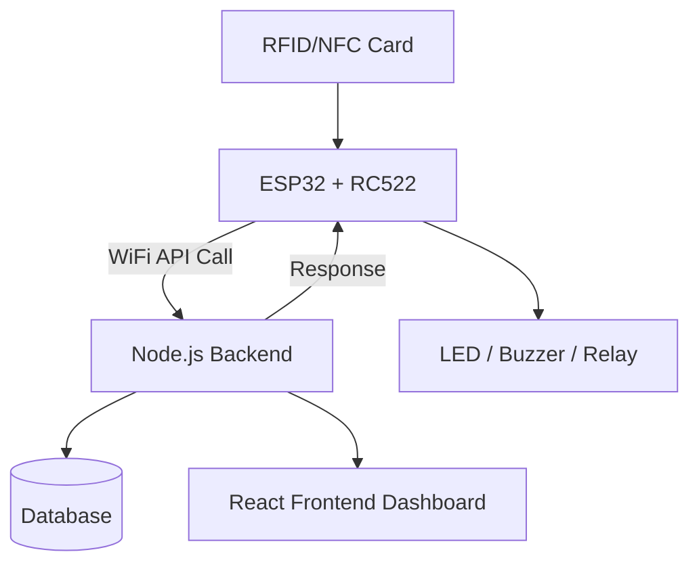

# Full Project Context for Another AI Agent

## User Hardware

The user currently has:

### Microcontroller

• ESP32-WROOM-32 Dev Board

### RFID/NFC Module

• MFRC522 RFID Module

### RFID Tags

• White RFID card
• Blue RFID keychain tag

### Development Environment

• Arduino IDE 1.8.19
• ESP32 board package installed
• MFRC522 library installed manually from:
[Miguel Balboa RFID Library](https://github.com/miguelbalboa/rfid?utm_source=chatgpt.com)

### User Tech Stack Skills

The user is experienced with:
• Node.js
• React.js
• Express.js
• MongoDB/PostgreSQL
• Full stack development
• AI systems
• WebSockets
• APIs

The user wants to integrate embedded systems with full stack backend architecture.

---

# Current Hardware Wiring

The RC522 is connected to ESP32 using SPI.

## Exact Working Connections

| RC522 Pin | ESP32 Pin |
| --------- | --------- |
| SDA       | GPIO 5    |
| SCK       | GPIO 18   |
| MOSI      | GPIO 23   |
| MISO      | GPIO 19   |
| RST       | GPIO 22   |
| GND       | GND       |
| 3.3V      | 3V3       |

IRQ is NOT connected.

Important:
RC522 must use 3.3V only.

---

# Important Debugging History

The system initially failed to detect RFID cards.

After extensive debugging, the issue was identified as:

```text id="cjlwm3"
Loose RST wire connection
```

SPI communication was already functioning correctly.

Diagnostic output confirmed:

```text id="cjlwm4"
RC522 Version: 0x92
RC522 communication OK
Antenna appears ENABLED
```

Card detection started working after fixing RST wiring.

Successful UID read:

```text id="mjlwm9"
UID (HEX): A7 BB 97 31
```

---

# Current Working Arduino Code

The following simplified code currently works successfully:

```cpp id="4jlwm6"
#include <SPI.h>
#include <MFRC522.h>

#define SS_PIN 5
#define RST_PIN 22

MFRC522 rfid(SS_PIN, RST_PIN);

void setup() {

    Serial.begin(115200);

    SPI.begin();

    rfid.PCD_Init();

    Serial.println("Tap RFID Card");
}

void loop() {

    if (!rfid.PICC_IsNewCardPresent())
        return;

    if (!rfid.PICC_ReadCardSerial())
        return;

    Serial.print("Card UID: ");

    for (byte i = 0; i < rfid.uid.size; i++) {

        Serial.print(rfid.uid.uidByte[i], HEX);
        Serial.print(" ");
    }

    Serial.println();

    rfid.PICC_HaltA();
}
```

---

# Current System Capabilities

The system can currently:

• Read RFID/NFC card UID
• Detect card presence
• Communicate with RC522 over SPI
• Print UID to Serial Monitor

The system has NOT yet implemented:
• WiFi communication
• Backend API integration
• Card writing
• Authentication logic
• Frontend dashboard
• Database integration

---

# User Goal

The user wants to build a complete RFID/NFC based authentication ecosystem.

## Desired Architecture



---

# Desired Features

## ESP32 Features

The ESP32 should:

• Connect to WiFi
• Read RFID/NFC cards
• Send UID to backend API
• Receive backend response
• Trigger hardware actions:
• LED
• buzzer
• relay
• Possibly support OTA updates later

---

# Backend Requirements

## Stack

Preferred:
• Node.js
• Express.js
• MongoDB or PostgreSQL
• Socket.IO for realtime updates

## Responsibilities

Backend should:

• Authenticate RFID cards
• Store users and cards
• Log access events
• Send action responses to ESP32
• Support frontend dashboard
• Support card management

---

# Frontend Requirements

Preferred:
• React.js

Frontend should provide:

• Live card scan monitoring
• Card registration
• User management
• Access logs
• Device status
• Card writing interface
• Realtime updates

---

# Card Data Strategy

Current recommendation:

Do NOT store sensitive information directly on card.

Recommended approach:

```text id="8jlwmx"
Card UID → Backend lookup → User identity
```

Example:

```text id="1jlwm0"
UID: A7BB9731

Backend:
A7BB9731 → User → Permissions
```

This is preferred over storing full user data on card.

---

# Future Expansion Ideas

Possible future upgrades:

• PN532 NFC module
• Phone NFC interaction
• Secure challenge-response authentication
• Offline UID caching on ESP32
• Door lock system
• OLED display
• AI anomaly detection
• Analytics dashboard
• OTA firmware updates

---

# Important Technical Notes

## Library Used

Using classic MFRC522 library:
[Miguel Balboa RFID Library](https://github.com/miguelbalboa/rfid?utm_source=chatgpt.com)

NOT using MFRC522v2 anymore.

---

# Known Working Conditions

## Serial Settings

Baud rate:

```text id="tjlwm2"
115200
```

## Board Selection

Arduino IDE:

```text id="8jlwm2"
ESP32 Dev Module
```

## Upload Notes

Sometimes ESP32 required:

```text id="qjlwm9"
holding BOOT button during upload
```

---

# Current Development Stage

The project is currently at:

```text id="6jlwm4"
Phase 1 Complete:
ESP32 successfully reads RFID card UID
```

Next expected stage:

```text id="bjlwm7"
Phase 2:
ESP32 WiFi integration + backend API communication
```
