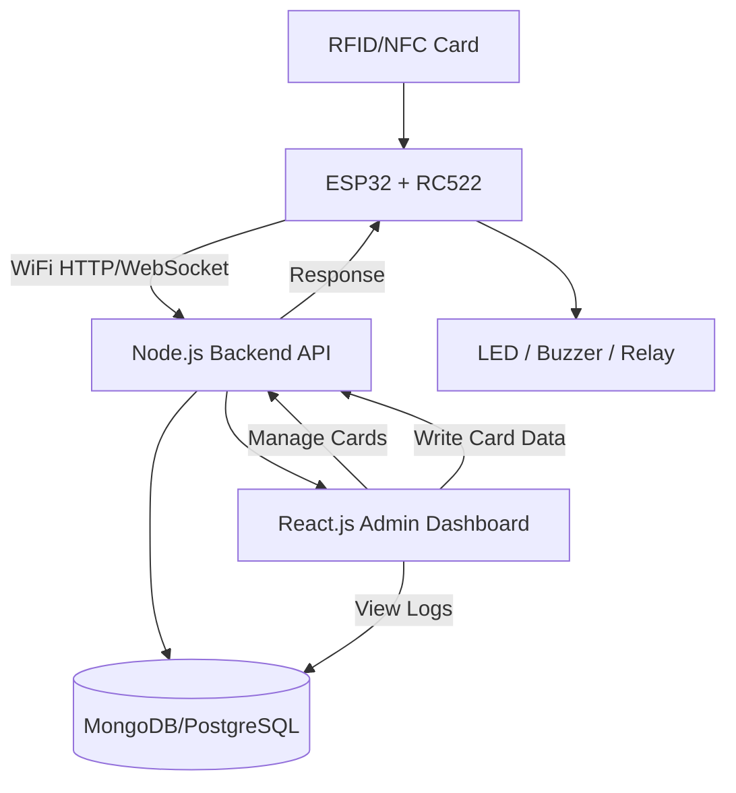
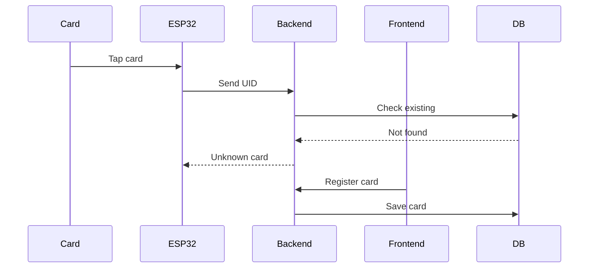
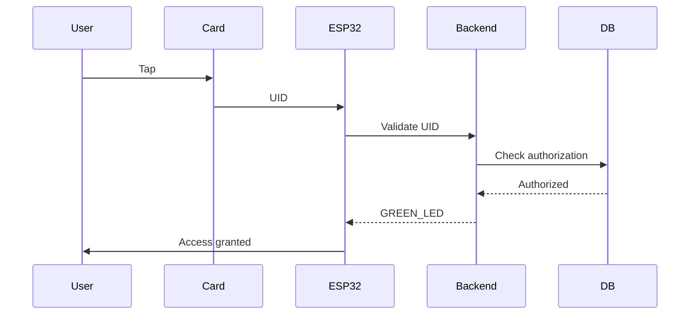
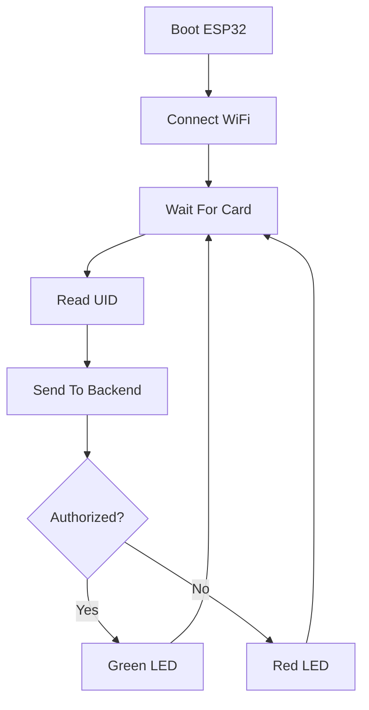

# NFC/RFID Smart Authentication System Architecture

Your idea is actually very close to how real enterprise access systems work:
• card tap
• edge device validation
• backend authorization
• frontend management dashboard
• hardware action response

You are basically building a distributed IoT authentication platform.

A strong architecture for your stack would look like this:



# Important Technical Clarification

Your current RC522 setup can:
• Read UID
• Read/write some card memory blocks
• Authenticate sectors
• Work with MIFARE Classic cards

But:
RC522 is NOT a full modern NFC platform.

For production grade NFC:
You eventually want:

PN532 NFC Module

because it supports:
• Better NFC compatibility
• Phone interaction
• Peer to peer
• Card emulation
• More stable writing

But for learning and MVP:
RC522 is PERFECT.

# Recommended Tech Stack

## Hardware Layer

### Required

| Component          | Purpose           |
| ------------------ | ----------------- |
| ESP32              | Edge device       |
| RC522              | RFID/NFC Reader   |
| RFID/NFC Cards     | Identity token    |
| LED                | Status indication |
| Buzzer             | Feedback          |
| Breadboard + wires | Prototyping       |

### Optional Future Upgrades

| Component      | Purpose         |
| -------------- | --------------- |
| Relay module   | Door lock       |
| OLED display   | Show status     |
| Servo lock     | Physical access |
| PN532          | Better NFC      |
| Battery backup | Reliability     |

# Backend Architecture

## Recommended Stack

| Layer                | Tech                  |
| -------------------- | --------------------- |
| Backend              | Node.js + Express     |
| Database             | MongoDB or PostgreSQL |
| Auth                 | JWT                   |
| Real-time            | Socket.IO             |
| Cache                | Redis                 |
| Device Communication | REST or WebSocket     |

# System Design

## 1. Card Registration Flow



# 2. Authentication Flow



# API Design

## Example Endpoints

### Card Validation

```http
POST /api/cards/validate
```

Request:

```json
{
  "uid": "A7BB9731",
  "deviceId": "gate-01",
  "timestamp": 1748100000
}
```

Response:

```json
{
  "authorized": true,
  "action": "GREEN_LED",
  "message": "Access Granted"
}
```

# ESP32 Firmware Architecture

## Responsibilities

ESP32 should:
• Read card UID
• Connect to WiFi
• Send UID to backend
• Receive response
• Trigger hardware actions
• Retry on failure
• Cache offline access optionally

# ESP32 Flow



# ESP32 Recommended Libraries

| Purpose | Library     |
| ------- | ----------- |
| WiFi    | WiFi.h      |
| HTTP    | HTTPClient  |
| RFID    | MFRC522     |
| JSON    | ArduinoJson |

# Frontend Features

## React Dashboard

### Pages

| Page          | Purpose            |
| ------------- | ------------------ |
| Dashboard     | Live activity      |
| Cards         | Manage cards       |
| Users         | Map users to cards |
| Access Logs   | History            |
| Device Status | ESP32 status       |
| Write Card    | Write NFC blocks   |

# Important Security Insight

DO NOT rely only on UID for security in production.

Why?

UID can sometimes be cloned.

Better architecture:

```text
UID + Backend Validation + Signed Data
```

Eventually:
• encrypted sectors
• rolling tokens
• challenge response auth

# Writing Data to Card

You can write:

| Type         | Example        |
| ------------ | -------------- |
| User ID      | EMP001         |
| Role         | ADMIN          |
| Expiry       | 2026-12-31     |
| Access token | encrypted blob |

But:
MIFARE Classic memory is small.

Typical safe strategy:

```text
Store minimal data on card
Store actual identity in backend
```

Example:

```text
Card:
UID → A7BB9731

Backend:
A7BB9731 → Junaid Ahmad → Admin
```

This is how enterprise systems usually work.

# Recommended Database Schema

## Users

```js
{
  _id,
  name,
  email,
  role,
  cardUID,
  isActive
}
```

## Access Logs

```js
{
  uid,
  userId,
  deviceId,
  status,
  timestamp
}
```

## Devices

```js
{
  deviceId,
  location,
  status,
  lastSeen
}
```

# Real-Time Dashboard

Use:
[Socket.IO](https://socket.io?utm_source=chatgpt.com)

Then:
• card taps instantly appear on dashboard
• device online/offline live
• live alerts

# Advanced Features You Can Add

## 1. Offline Mode

ESP32 caches authorized UIDs locally.

Useful when internet fails.

## 2. OTA Updates

Update ESP32 firmware remotely.

## 3. Analytics

Track:
• peak usage
• unauthorized attempts
• user activity

## 4. AI Layer

You can later add:
• anomaly detection
• suspicious access patterns
• predictive alerts

# Recommended Project Structure

## Backend

```text
backend/
├── src/
│   ├── routes/
│   ├── controllers/
│   ├── services/
│   ├── models/
│   ├── middleware/
│   ├── sockets/
│   └── utils/
```

## Frontend

```text
frontend/
├── src/
│   ├── pages/
│   ├── components/
│   ├── hooks/
│   ├── services/
│   └── store/
```

## ESP32

```text
firmware/
├── wifi/
├── rfid/
├── api/
├── led/
└── main.ino
```

# Suggested Development Roadmap

## Phase 1

DONE
• ESP32 reads RFID UID

## Phase 2

NEXT
• ESP32 connects WiFi

## Phase 3

• ESP32 sends UID to backend

## Phase 4

• Backend validates UID

## Phase 5

• LED response system

## Phase 6

• React dashboard

## Phase 7

• Card registration panel

## Phase 8

• Real-time monitoring

## Phase 9

• Card writing support

# Most Important Engineering Advice

Treat your ESP32 as:

```text
edge authentication node
```

NOT just:

```text
microcontroller toy
```

That mindset changes architecture quality dramatically.

You are already moving toward:
• embedded systems
• IoT infrastructure
• distributed authentication systems
• real-time device orchestration

which is genuinely industry relevant engineering.
